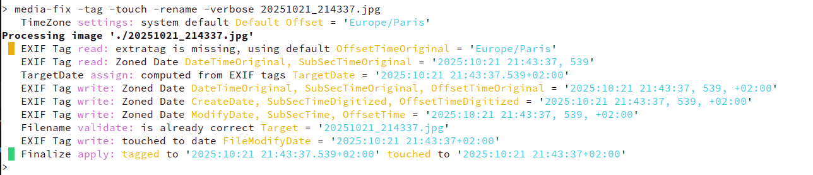

# media-fix

`media-fix` is a Perl-based utility designed to repair, synchronize, and standardize metadata (EXIF/XMP) and filenames for photo and video collections. It handles complex timezone offsets and restores missing metadata using filename patterns.

- repair EXIF metadata
- rename the file
- update the filesystem modify time
- generate an XMP sidecar

The default operating mode is `dry-run` which will only reports the planned actions, the changes are applied only when `-run` is enabled.

`media-fix` will scan all your files, recursively, and use the MIME type to process images and videos.

## Usage

```bash
media-fix -tag|-touch|-rename|-xmp [-run] [-strict] [-skiptag] [-tz='str'] [-verbose] [FILE]
```

### Options

* **-tag** : Rewrite/fix incomplete EXIF date tags, usually from the filename.
* **-skiptag** : Ignore existing EXIF dates to force new dates from the filename.
* **-touch** : Change file modification date according to the target date.
* **-rename** : Change filename according to the target date.
* **-strict** : Enforce strict renaming format `YYYYMMDD_HHMMSS`.
* **-xmp** : Write an XMP sidecar with the correct `FileModifyDate` and timezone.
* **-run** : **Execution mode.** By default, the script runs in **Dry-Run** mode (no changes applied).
* **-tz='str'** : Override default timezone (e.g., `-tz='Europe/Lisbon'`).
* **-verbose** : Write detailed logs to the console and `process.log`.
* **FILE** : Optional. If not specified, processes the current directory tree recursively.

---

## High-Level Flow

At a high level, `media-fix` follows this sequence:

1. Try to determine the target date from EXIF metadata, unless `-skiptag` was requested.
2. Fall back to parsing the filename if metadata is missing or unusable.
3. Apply the user input/configuration/GPS offset or system TimeZone.
4. Abort if no valid date can be determined.
5. If `-tag` is enabled, write corrected metadata when needed.
6. If `-rename` is enabled, compute and stage a safe target filename when needed.
7. If `-touch` is enabled, update the file modification timestamp when needed.
8. If `-xmp` is enabled, generate an XMP sidecar when needed.


## Step-by-Step Explanation

### 1. Read EXIF metadata first unless `-skiptag` is set

If the user passes `-skiptag`, the method deliberately avoids reading embedded timestamps and logs that choice. This is useful when the file metadata is known to be wrong and the filename should be treated as the source of truth.

Otherwise, the method tries to extract a `TargetDate` from embedded EXIF metadata:

- For images, it will use standard tags with their subsecond and offset companions:

| Date Tag | SubSec Tag | Offset Tag |
| :--- | :--- | :--- |
| DateTimeOriginal | SubSecTimeOriginal | OffsetTimeOriginal |
| CreateDate | SubSecTimeDigitized | OffsetTimeDigitized |
| ModifyDate | SubSecTime | OffsetTime |
- For videos, it tries several QuickTime-style creation/modification fields such as `MediaCreateDate`, `MediaModifyDate`, `TrackCreateDate`, and `TrackModifyDate`.

The first valid tag is being used for the rest of processing.


### 2. Parsing the filename

After EXIF extraction, the filename will be parsed for completing the metadata, also trying to get a `TargetDate` if it was not yet found.

Valid patterns that can be parsed:

- standard timestamped names such as `YYYYMMDD_HHMMSS`
- extended names with milliseconds or offset as `YYYYMMDD_HHMMSS.xxx±00:00`
- WhatsApp-style names like `IMG-20251130-WA0003.jpg`

Anything found **after** a matching date will be kept as `remainder` and used for the final name.
Some cleanup is applied to the `remainder`, like removing trailing `~1, ..., _01, ..., _HDR`

If you want to rename only with the `YYYYMMDD_HHMMSS` pattern, use the `-strict` parameter.

**Note for WhatsApp:** The name/date is completely wrong, not corresponding to the actual date of the asset, but when the file was sent.

The hours/minutes/seconds will be computed from the trailing digits after `WA` as a number of seconds added to `12:00:00`, the goal being to have distinct filenames.
```
WA00001 -> 12:00:01
WA03670 -> 13:01:10
```
```bash
> media-fix -tag -skiptag IMG-20250714-WA1234.jpg
'./IMG-20250714-WA1234.jpg' tagged to '2025:07:14 12:20:34.000+02:00'
```


### 3. Determine TimeZone / Offset

If the `Offset` couldn't be read from either the EXIF metadata or the filename, `media-fix` defaults to the system local time.

Note that if the `GPSDateStamp` and `GPSTimeStamp` EXIF tags are present (picture with GPS details), then the `Offset` is computed properly.

You can change this behavior:

1. As `a whole override`, with the `-tz` parameter in the command line, use a valid TimeZone [from this list](https://en.wikipedia.org/wiki/List_of_tz_database_time_zones#List) (highest priority).
2. For `one folder only`, creating an empty file inside that directory, starting with `.tz` (e.g., `.tz_europe_lisbon`).

**Note on Videos:** The tool automatically converts UTC-stored video metadata (QuickTime/MP4 standard) to your target or overridden timezone.


### 4. Repair EXIF metadata when tagging is requested

If `-tag` is enabled, the method decides whether metadata should be rewritten.

- when the existing metadata was incomplete or missing important parts such as subseconds or timezone offsets
- `-skiptag` was used, meaning the filename-derived target should overwrite embedded metadata

The exact write strategy depends on the media type:

- Images get `DateTimeOriginal`, `CreateDate`, and `ModifyDate` fields written using the `TargetDate`, along with their matching subsecond and offset tags.
- Videos get `QuickTime:CreateDate`, `QuickTime:ModifyDate`, `QuickTime:MediaCreateDate`, `QuickTime:MediaModifyDate`, `QuickTime:TrackCreateDate` and `QuickTime:TrackModifyDate` fields written, using the `TargetDate` converted to UTC.

If tagging was not needed, the method records a no-op result instead of staging writes.


### 5. Compute a safe rename

If `-rename` is enabled, it builds the desired filename from the resolved target date:

- first using `YYYYMMDD_HHMMSS`
- then, if necessary, adding the milliseconds `YYYYMMDD_HHMMSS.xxx` to avoid name collisions

If the filename is already correct, nothing is renamed.


### 6. Align the filesystem modification date

This keeps the file’s modification timestamp aligned with the chosen target date in system-local time. It updates `FileModifyDate` when:

- the current modification date differs from the target
- or metadata / rename operations are also being applied, so the file should stay consistent

This makes the filesystem timestamp part of the same normalization pipeline.


### 7. Create an XMP sidecar when requested

If `-xmp` is enabled, the script may create an `.xmp` sidecar, but only in the case:

- the item EXIF tag are incomplete
- the file is an image
- the `.xmp` file does not already exist

The sidecar contains `XMP-exif:DateTimeOriginal` set to the resolved target timestamp.

This is effectively a non-destructive fallback path: instead of rewriting the asset itself, the script can externalize the corrected timestamp into XMP for downstream tools such as `Immich`.

With this method you can fix your library without touching your assets. Note however that Immich is currently (v2.6.1) not handling XMP files efficiently.
```bash
> media-fix -xmp -run 20251021_214337.jpg
'./20251021_214337.jpg' XMP file written

> cat 20251021_214337.jpg.xmp 
<?xpacket begin='' id='...'?>
<x:xmpmeta xmlns:x='adobe:ns:meta/' x:xmptk='Image::ExifTool 13.50'>
<rdf:RDF xmlns:rdf='http://www.w3.org/1999/02/22-rdf-syntax-ns#'>

 <rdf:Description rdf:about=''
  xmlns:exif='http://ns.adobe.com/exif/1.0/'>
  <exif:DateTimeOriginal>2025-10-21T21:43:37.000+02:00</exif:DateTimeOriginal>
 </rdf:Description>
</rdf:RDF>
</x:xmpmeta>
<?xpacket end='w'?>
```

You will need to generate all your XMP, then in Immich navigate to _Administration > Job Queues > Sidecar Metadata > Discover_.

This will make your XMP files visible for Immich and will trigger the _Extract Metadata_ (unfortunately on *ALL* you assets).

---

## Additionnal scenario

### Ignoring Directories

To skip a directory during recursive processing, place an empty file named `.noprocess` in that folder.


### Forcing Incorrect EXIF Metadata

By combining filename recognition with the `-skiptag` parameter, you can force or reset existing but incorrect EXIF tags.

Simply rename your image/video file first with the desired date pattern you want and then run the command with both `-tag` and `-skiptag` to overwrite the internal metadata.


### Restoring broken assets library

This tool can also be used to restore the correct filenames from a damaged filesystem.

After recovering the files with tools like `testdisk/photorec`, you can rename images/videos from their EXIF tags using the `-rename` tag:
```
> media-fix -tag -touch -rename has-good-exif 
'./has-good-exif' touched to '2023:09:14 17:20:02+02:00' renamed to '20230914_172002 has-good-exif.jpg'
```

---

## Examples

**Dry-Run (preview only):**
```bash
media-fix -tag -touch -rename
```

**Full Execution:**
```bash
media-fix -tag -touch -rename -run
```

**Full Execution with logging:**



---

## Requirements
* Perl
* `Image::ExifTool`
* `File::Find::Rule`
